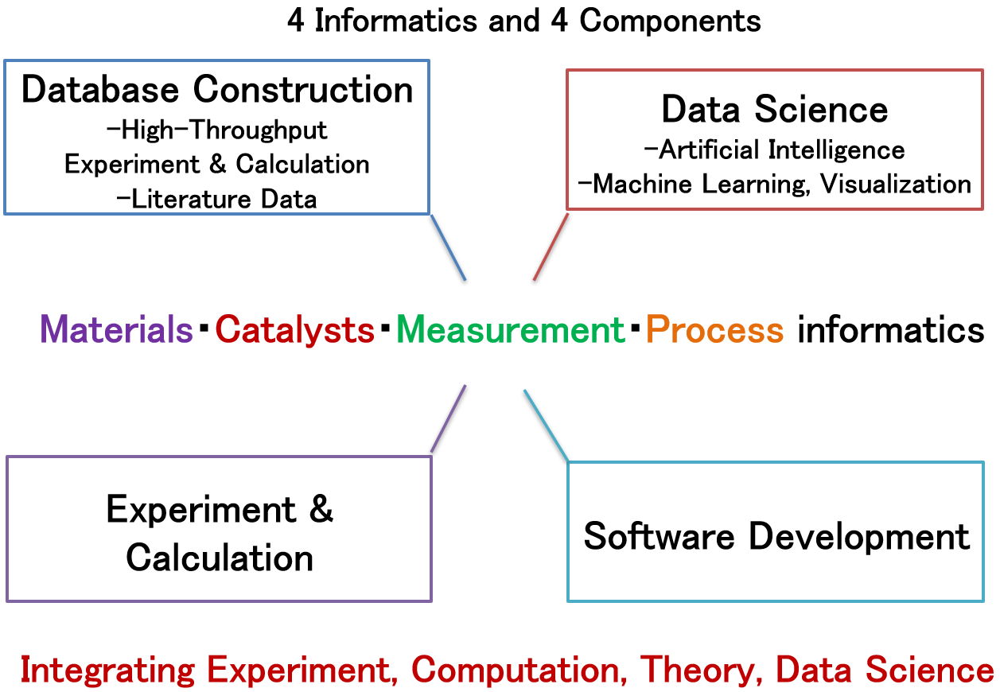
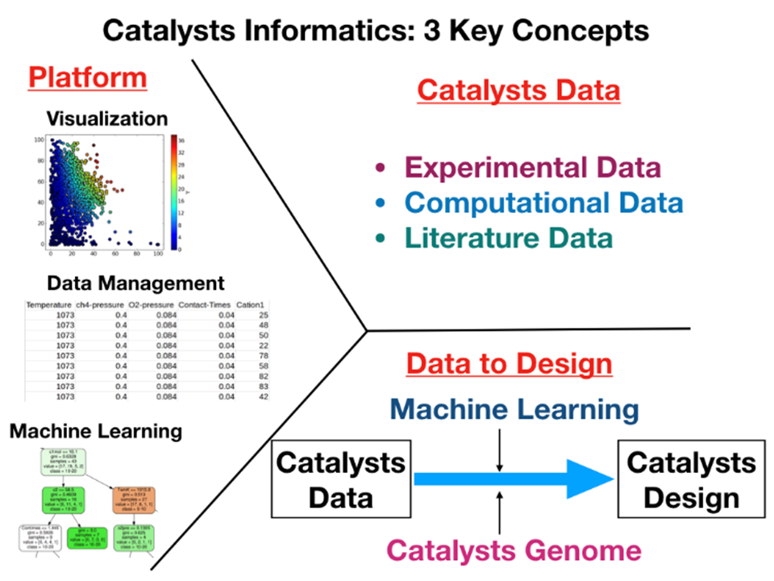
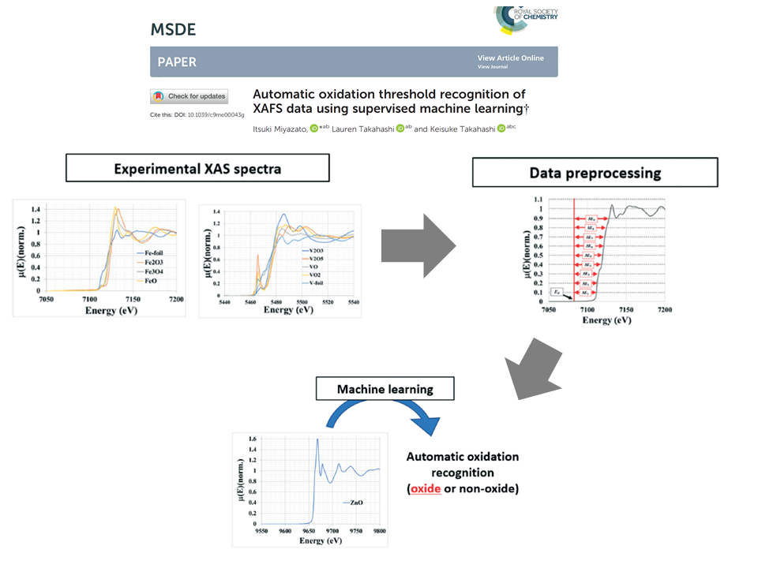
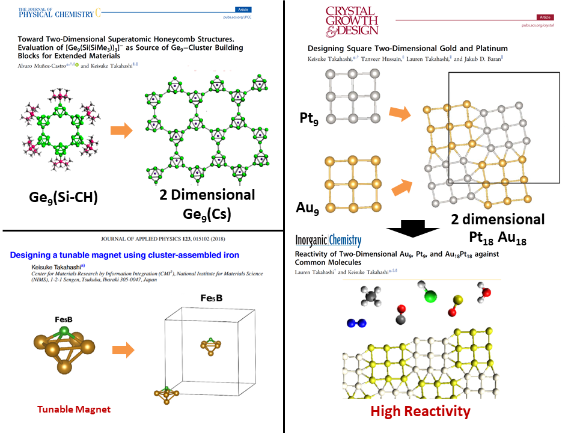
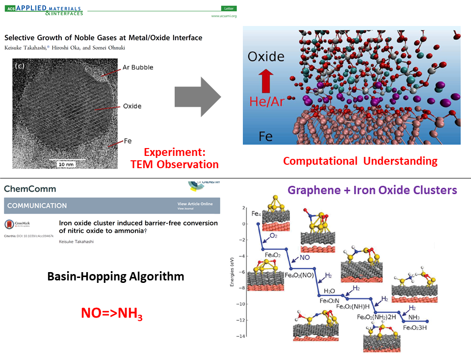

Takahashi Group focuses on the design of materials, catalysts, and chemical reactions in a combination of experiments, theory, computations, and data science. 
To do this, we focus on research in four different areas: <b>Database Construction</b>, <b>Experiment & Calculation</b>, <b>Data Science</b>, and <b>Software Development</b>.

<u>Database construction</u> is carried out using data collected from high-throughput experiments and calculations as well as literature data. 
<u>Data science</u> endeavors involve artificial intelligence, machine learning, visualization, or some combination of the aforementioned techniques. 
<u>Experiments and calculations</u> are used to design and test various catalysts and reactions. 
<u>Software development</u> includes developing the CADS platform, which is a materials informatics platform designed for sharing material data and providing on-site informatics tools that are accessible for experts and non-experts alike.

<h3>By addressing these four areas, we are able to cover aspects of four types of informatics: Materials Informatics・Catalyst Informatics・ Measurement Informatics・Process Informatics</h3>
 
<h1>Current Areas of Research</h1>

Current research topics fall within the following areas:

- Materials Informatics
- Catalysts Informatics
- Measurement Informatics & Signal Processing 
- Atomic Clusters & Cluster Assembled Materials 
- Heterogeneous Catalysts & Energy Materials

<h2><b>Materials Informatics</b></h2>
Materials informatics is the field where data science and materials science are integrated. We implement various data science techniques including machine learning, multi-dimensional visualization, and statistics towards designing materials.

<h2><b>Catalysts Informatics</b></h2>
Materials informatics is applied in catalysis where data science is implemented for seeking catalysts as well as optimizing the experimental process conditions during the reactions. For further details concerning this work, please visit the Catalysts Informatics project page. http://catalystinfo.eng.hokudai.ac.jp/index-e.html

<h2><b>Measurement Informatics & Signal Processing</b></h2>
Materials Informatics is also applied in the field of measurements. In particular, spectra gained from XAFS, Raman, and EELS are intensively analyzed using data science where algorithms for decomposing such complex peaks are also investigated.

<h2><b>Atomic Clusters & Cluster-Assembled Materials</b></h2>
Atomic clusters consist of few to hundreds of atoms. Because of the high surface to volume ratio, properties of clusters are different from their bulk and nanoparticle counterparts. We treat those small clusters as building blocks for designing further complex and unique crystals.

<h2><b>Heterogeneous Catalysts & Energy Materials</b></h2>
By combining experiment, theory, computation, and data science, we are designing unique and novel Heterogeneous Catalysts and Energy Materials. We design two dimensional materials; zeolites; oxide surfaces for COx and NOx; and CH4 activation. For energy materials, we are designing high performence two dimensional materials and perovskite materials for gas storage as well as photovoltaic cell applications.

<h1>Interested in joining?</h1>
Please contact me <b>(keisuke.takahashi[at]sci.hokudai.ac.jp)</b> if you are interested in working on the above research.
I have several suggestions for Masters, PhD, and Post-Doc.
